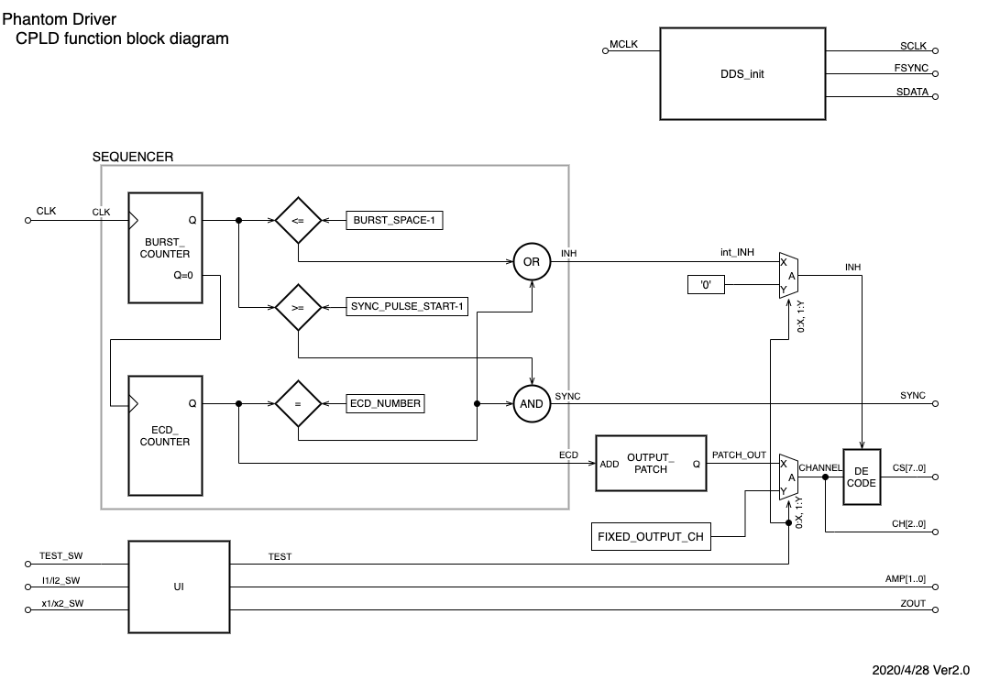

# PhantomDriver

### 概要

このリポジトリは、__ESM50902 コイルドライバ__ のためのコードです。

もとになったのは、SHI向けファントムドライバのHDLコードで下記の内容が変更になっています。

- 周波数  80Hz
- 波数 24波、24 コイル
- （1波休み 24波出力）x 24 + (25波 休み)
- SCSI 1pin = coil 0
- 同期信号：最初のバースト波の1波目

下記に示すリソースがあります。

- CPLD内部の機能ブロックダイアグラム
- CPLDのHDL記述
- 概略のタイミング図（動作の理解として）
- Top Level Entity のテストベンチ
- Quartus Primeでコンパイルするためのプロジェクトファイルなど
  - 最低限必要なModelSIM実行のためのテストベンチコード
  - 波形観測用の設定(.do)など
- ピンアサインデータ
- ピンの名前と機能

## ブロックダイアグラム
**(このブロック図はSYNC合成の部分のロジックがちょっと違っていますが、全体像を把握するのには十分です)**

##
### SEQUENCER + OUTPUT_PATCH
__CLK__ にはECD用の発振器と同期したクロックが入ります。

BURST_COUNTERでは、その「波数」を数えると同時に、バースト波を作るための、「出力インヒビット」信号: __INH__ を作成します。

バースト波は、「スペース」＋「マーク」の順番に出力されます。これは、ECD切り替えのタイミングで出力をOFFにしておきたいためです。

ECD_COUNTERはBURST_COUNTERが"0"の時にカウントアップすることで、出力しているECDの番号を示します。

ECD_COUNTERが最大値"ECD_NUMBER"の時、１スキャンの終了という意味で出力しない期間を作ります。

__SYNC__ 信号はECD_COUNTERが最大値の時、指定されたパルス幅"SYNC_PULSE_START"で、出力されます。

__SYNC__ ~~信号のOFF-SETタイミングはECD_COUNTERが0になる（次のスキャンが始まる）時で、固定です。ON-SETは指定されたパルス幅を満たすようにOFF-SET位置から逆算したタイミングになります。~~
この設計では、１つ目のバースト波の1波目と同じタイミングで1波分のパルスが出力されます。（過去の製品とのコンパチビリティ）

パルス位置はパラメタライズされていません。

__OUTPUT_PATCH__ により、ECD番号は実際に信号が出力されるコネクタのピン番号にアサインされます。具体的には、ECD番号とハードウエア上のアナログマルチプレクサの番号（8個）とそのチャネル指定（8ch）を結びつけます。

##
### UI
__TEST_SW__ : 動作試験のために定常的にECDを発生する目的で使用します。この入力とTEST信号が連動しており、TEST信号が"1"のとき連続的に固定されたチャネル（ __FIXED_OUTPUT_CH__ )に信号が出力されます。

__I1/I2_SW, x1/x2_SW__ : これらの入力はECD出力電流を設定するために適宜修飾されて、ECD電流値を決定する回路の設定（ __AMP_GAIN, Z_OUT__ )として出力されます。

##
##### NOTE:
- ブロック図を編集する場合は[こちら](https://drive.google.com/file/d/1guEd1JOVNZys2o42kFn0YsHypVKk4kI3/view?usp=sharing)をクリックしてください。 GoogleDrive でのプレビューから　draw.io　へのリンクが表示されます。
- 図面内に編集した人の名前、日付、変更内容を10ポイント程度の小さめの文字で右下に記載してください。
- 編集し終わったら、保存し、File - Export As... からPDFとPNG型式でこのリポジトリに直接アップロード(コミット)してください。
